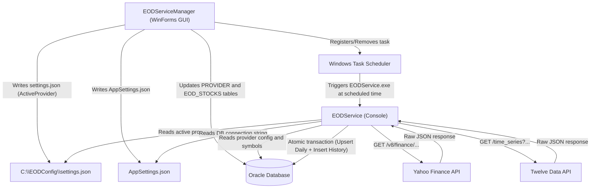

# EOD Service Manager & Data Importer

A robust .NET 10.0 solution for automating the retrieval, mapping, and persistence of **End-of-Day (EOD) stock market data** into an **Oracle Database**. The system is composed of two projects:

| Project | Type | Purpose |
| :--- | :--- | :--- |
| **EODService** | .NET Console App | Fetches EOD data from external APIs and persists it to Oracle DB |
| **EODSettingsApp** (EODServiceManager) | .NET WinForms App | GUI for managing DB connections, symbols, provider configs, and scheduling |

---

## Architecture Overview



---

## Solution Structure

```
EODService/
├── EODService/                          # Console importer (EODService.exe)
│   ├── Config/
│   │   └── PathesConfig.cs              # Resolves all file paths from PathesConfig.json
│   ├── DTOs/
│   │   ├── OracleConnectionString/      # Oracle connection string mapper
│   │   ├── Provider/                    # ProviderDTO + ProviderMapper
│   │   ├── ProviderSettings/            # ProviderSettings + ProviderSettingsMapper
│   │   ├── SymbolSettings/              # SymbolSettings + SymbolSettingsMapper
│   │   ├── YahooEODResponse/            # Yahoo JSON response DTOs + YahooEodMapper
│   │   ├── TwelveDataResponse/          # TwelveData JSON response DTOs + TwelveDataMapper
│   │   ├── YahooSettings/               # YahooParametersDTO
│   │   └── TwelveDataSettings/          # TwelveDataParametersDTO
│   ├── Logging/
│   │   └── FileLoggerProvider.cs        # Custom file logger (daily rolling log files)
│   ├── Models/
│   │   ├── EOD/                         # EodData, EodDataDaily, EodDataHistory, EodMapper
│   │   ├── Provider/                    # Provider model
│   │   ├── Stock/                       # Stock model
│   │   └── ProviderIds.cs               # Enum: Yahoo = 1, TwelveData = 2
│   ├── Persistance/
│   │   ├── AppDbContext.cs              # EF Core DbContext (Oracle)
│   │   ├── AppDbContextFactory.cs       # Creates DbContext from connection string
│   │   └── Repo/
│   │       ├── IProvider.cs / ProviderRepo.cs  # Provider DB operations (raw SQL)
│   │       ├── IStock.cs   / StockRepo.cs       # Stock DB queries by provider flag
│   │       └── IEodData.cs / EodDataRepo.cs     # EOD data DB operations
│   ├── Services/
│   │   ├── IEODService.cs               # Interface: GetEodDataAsync()
│   │   ├── EODServiceFactory.cs         # Factory: creates Yahoo or TwelveData service by provider ID
│   │   ├── YahooEODService.cs           # Yahoo Finance data fetcher and mapper
│   │   ├── TwelveDataEODService.cs      # Twelve Data API data fetcher and mapper
│   │   └── EodPersistenceService.cs     # Shared persistence (SaveAsync, GetSymbols, GetProvider)
│   ├── AppSettings.json                 # DB connection, schedule, symbol and provider config
│   └── PathesConfig.json                # Path overrides for config, logs etc.
│
├── EODSettingsApp/                      # WinForms settings manager (EODServiceManager.exe)
│   ├── AppSettingsConfig/
│   │   ├── AppSettingsModel.cs          # Model for all AppSettings.json sections
│   │   ├── AppSettingsPath.cs           # Resolves the runtime path to AppSettings.json
│   │   └── AppSettingsService.cs        # Load/Save AppSettings.json (section-safe merge)
│   ├── ExternalConfig/
│   │   └── ExternalSettingsService.cs   # Load/Save settings.json (ActiveProvider)
│   ├── Forms/
│   │   ├── SettingsForm.cs              # Main dashboard: schedule, provider selector, EOD grid, live log
│   │   ├── DatabaseSettingsForm.cs      # DB connection builder, live parsing, test and save
│   │   ├── ProviderSettingsForm.cs      # Yahoo and TwelveData editor (URL, Endpoint, API Key, JSON params)
│   │   ├── SymbolSettingsForm.cs        # Stock grid editor: view, update, delete, save to EOD_STOCKS
│   │   └── HierarchicalSettingsForm.cs  # Additional hierarchical configuration form
│   ├── Services/
│   │   ├── EodServiceLauncher.cs        # Locates and launches EODService.exe as a child process
│   │   └── WindowsTaskSchedulerService.cs  # Registers/removes Windows Scheduled Task
│   └── PathesConfig.json                # Path overrides for this app
│
├── EODServiceInstaller.iss              # Inno Setup script: packages EODServiceManager
└── EODService.slnx                      # Solution file
```

---

## Database Schema and ORM Mapping

Entity Framework Core is used with the **Oracle.EntityFrameworkCore** provider.

### Tables

| EF Entity | Oracle Table | Primary Key | Description |
| :--- | :--- | :--- | :--- |
| `Stock` | `EOD_STOCKS` | `STOCK_ID` | Master list of tracked stocks with per-provider ticker symbols and active flags |
| `Provider` | `PROVIDER` | `ID` | API provider configurations (URL, endpoint, API key, JSON params) |
| `EodDataDaily` | `EodDaily` | `STOCK_ID` | Latest EOD price per stock — upserted on each run |
| `EodDataHistory` | `EodHistory` | (`STOCK_ID`, `DATE`) | Full historical EOD price log — new rows inserted, duplicates skipped |

### EOD_STOCKS Column Mapping

| Column | Property | Notes |
| :--- | :--- | :--- |
| `STOCK_ID` | `Id` | Auto-generated primary key |
| `SC_COMP_ID` | `SC_Comp_Id` | Companion company ID |
| `STOCK_NAME` | `StockName` | Full name of the stock |
| `ISIN` | `ISIN` | International Securities Identification Number |
| `Y_FINANCE` | `YahooFinanceID` | Yahoo Finance ticker (e.g. `CBKD.L`) |
| `YF_FLAG` | `YahooFinanceExists` | `'Y'`/`'N'` mapped to `bool`; controls Yahoo query filter |
| `T_DATA` | `TwelveDataID` | Twelve Data ticker (e.g. `CBKD`) |
| `TD_FLAG` | `TwelveDataExists` | `'Y'`/`'N'` mapped to `bool`; controls TwelveData query filter |
| `SC_EXCHANGE` | `StockExchange` | Exchange code |

### PROVIDER Column Mapping

| Column | Property | Notes |
| :--- | :--- | :--- |
| `ID` | `Id` | Provider ID (1 = Yahoo, 2 = TwelveData) |
| `PROVIDER` | `Name` | Human-readable provider name |
| `BASE_URL` | `BaseUrl` | Root URL for API calls |
| `ENDPOINT` | `EndPoint` | Specific endpoint path |
| `API_KEY` | `ApiKey` | Optional API authentication key |
| `PARAMETERS` | `Parameters` | JSON string with extra query params (interval, range, outputsize, etc.) |

---

## Configuration

### PathesConfig.json

Controls where all runtime files are located. Both projects ship their own copy.

```json
{
  "ActiveProviderSettingsPath": "C:\\EODConfig\\settings.json",
  "AppSettingsPath": "AppSettings.json",
  "LogFolderPath": "C:\\EODConfig\\Logs"
}
```

| Field | Purpose |
| :--- | :--- |
| `ActiveProviderSettingsPath` | External JSON file storing the currently active provider ID |
| `AppSettingsPath` | Path to main application settings (DB, schedule, symbols) |
| `LogFolderPath` | Root folder for rolling daily log files |

### AppSettings.json (EODService)

```json
{
  "ScheduleSettings": {
    "Enabled": true,
    "WorkingDays": ["Monday", "Tuesday", "Wednesday", "Thursday", "Friday"],
    "RunTime": "16:16:00"
  },
  "ConnectionStrings": {
    "DefaultConnection": "Data Source=(DESCRIPTION=(ADDRESS=(PROTOCOL=TCP)(HOST=...)(PORT=1521))...)..."
  },
  "SymbolSettings": { "Symbols": [] },
  "YahooSettings":    { "ID": 1, "BaseUrl": "", "Endpoint": "", "Interval": "", "Range": "" },
  "TwelveDataSettings": { "ID": 2, "BaseUrl": "", "Endpoint": "", "Interval": "", "OutputSize": 0, "ApiKey": "" }
}
```

### settings.json (Active Provider)

Located at `ActiveProviderSettingsPath` (default: `C:\EODConfig\settings.json`). Managed by EODServiceManager, read by EODService at startup.

```json
{
  "ProviderSettings": {
    "ActiveProvider": 1
  }
}
```

`ActiveProvider: 1` = Yahoo Finance, `ActiveProvider: 2` = Twelve Data.

---

## Supported Providers

| ID | Provider | Query Parameters |
| :--- | :--- | :--- |
| `1` | **Yahoo Finance** | `interval`, `range` (from PARAMETERS column JSON) |
| `2` | **Twelve Data** | `interval`, `outputsize`, `apikey` (from PARAMETERS column JSON) |

### Adding a New Provider

1. Create a new class implementing `IEODService` (e.g. `BloombergEODService`).
2. Insert a row into the `PROVIDER` Oracle table with the next sequential ID.
3. Add the enum value to `ProviderIds.cs`.
4. Add a new `case` in `EODServiceFactory.cs`.

---

## EODService Execution Flow

When `EODService.exe` is triggered (manually or by Task Scheduler):

```
Step 1  → Setup logging: FileLoggerProvider (file) + ConsoleLogger
Step 2  → Write run-start banner to today's log file
Step 3  → Read Oracle connection string from AppSettings.json
Step 4  → Connect to Oracle Database (AppDbContextFactory)
Step 5  → Load ProviderSettings: read ActiveProvider ID from settings.json
Step 6  → Load Provider config row from PROVIDER table (BaseUrl, Endpoint, Parameters, etc.)
Step 7  → Load symbols from EOD_STOCKS filtered by YF_FLAG or TD_FLAG
Step 8  → Create shared HttpClient (30s timeout, browser User-Agent headers)
Step 9  → EODServiceFactory creates YahooEODService or TwelveDataEODService
Step 10 → GetEodDataAsync(): downloads OHLCV per symbol with 200ms delay between requests
Step 11 → EodPersistenceService.SaveEodDataAsync():
             Atomic DB transaction:
               (a) Upsert into EodDaily  (update if STOCK_ID exists, insert if new)
               (b) Insert into EodHistory (skip if (STOCK_ID, DATE) key already exists)
               (c) Commit — or Rollback on any failure
```

---

## EODServiceManager UI (WinForms)

### Forms Overview

| Form | Purpose |
| :--- | :--- |
| `SettingsForm` | **Main dashboard** — active provider dropdown, schedule (working days + run time), live EOD data grid, live log tail, manual run button |
| `DatabaseSettingsForm` | **DB connection** — form fields (host, port, service name, user, password) that live-build the Oracle connection string; test and save buttons |
| `ProviderSettingsForm` | **API providers** — two-tab editor for Yahoo Finance and Twelve Data; fields for Base URL, Endpoint, API Key, and JSON Parameters; validates JSON before saving to PROVIDER table |
| `SymbolSettingsForm` | **Symbol management** — grid view of all EOD_STOCKS records; edit name, ISIN, ticker IDs, active flags per provider; delete stocks; commit changes to Oracle DB |

### Live Log Monitoring

`SettingsForm` polls the current day's log file every **2 seconds** using a `System.Windows.Forms.Timer`. New content is appended to the log panel automatically. The grid also auto-refreshes after a successful import is detected.

---

## Logging

**Path pattern:** `{LogFolderPath}\{yyyy-MM}\{yyyy-MM-dd}.txt`

**Example:** `C:\EODConfig\Logs\2026-08\2026-08-24.txt`

**Log line format:**
```
HH:mm:ss | LEVEL   | ShortClassName           | message
16:14:55 | INFO    | YahooEODService           | Downloading EOD data for CBKD.L...
16:14:56 | INFO    | YahooEODService           | Successfully downloaded 1 record for CBKD.L.
16:14:57 | WARNING | YahooEODService           | Symbol XYZ not found on LSE (404). Skipping.
16:14:57 | ERROR   | EodPersistenceService     | Error occurred while processing database save operation.
```

Each run begins with a separator banner:
```
===============================================================
  RUN STARTED  |  2026-08-24  16:14:53
===============================================================
```

---

## Windows Task Scheduler Integration

`WindowsTaskSchedulerService` manages a task named **`EODService_AutoImport`**:

- **Run level:** Standard user (LUA) — no Administrator elevation needed
- **Trigger:** `WeeklyTrigger` — fires on configured days at configured time
- **Action:** Runs `EODService.exe` with its working directory set correctly
- **Disabled/empty days:** task is automatically deleted from Task Scheduler

`EodServiceLauncher` resolves `EODService.exe` by checking:
1. Same directory as `EODServiceManager.exe` (production layout)
2. Sibling `EODService\bin\Debug\net10.0\` (development layout)

---

## Setup and Deployment

### Prerequisites

- Windows OS (.NET WinForms + Task Scheduler)
- .NET 10.0 SDK
- Oracle Database with write access to `PROVIDER`, `EOD_STOCKS`, `EodDaily`, `EodHistory`
- Inno Setup (optional, for installer generation)

### Initial Setup

1. Create `C:\EODConfig\` directory.
2. Create `C:\EODConfig\settings.json`:
   ```json
   { "ProviderSettings": { "ActiveProvider": 1 } }
   ```
3. `C:\EODConfig\Logs\` is created automatically on first run.

### Build and Publish

```powershell
# Publish EODService console app
dotnet publish EODService/EODService.csproj -c Release -r win-x64 --self-contained -o ./publish_output

# Publish EODServiceManager WinForms app
dotnet publish EODSettingsApp/EODSettingsApp.csproj -c Release -r win-x64 --self-contained -o ./publish_forms
```

### Installer

Run `EODServiceInstaller.iss` with Inno Setup to produce `EODServiceManager_Setup.exe`.  
Installs to `%LocalAppData%\EODServiceManager`. No admin rights required (`PrivilegesRequired=lowest`).

---

## Key NuGet Dependencies

| Package | Version | Used By |
| :--- | :--- | :--- |
| `Oracle.EntityFrameworkCore` | 10.23.x | Both |
| `Oracle.ManagedDataAccess.Core` | 23.26.x | EODService |
| `Microsoft.EntityFrameworkCore` | 10.0.10 | Both |
| `Microsoft.Extensions.Configuration.Json` | 10.0.10 | Both |
| `Microsoft.Extensions.Logging.Console` | 10.0.10 | EODService |
| `TaskScheduler` | 2.11.0 | EODSettingsApp |
