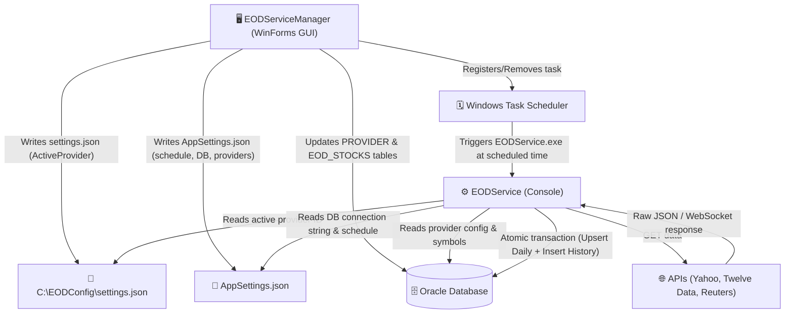

# EOD Service Documentation: System Overview

## Purpose and Audience
The EOD Service Manager & Data Importer is a robust .NET 10.0 solution designed to automate the retrieval, mapping, and persistence of End-of-Day (EOD) stock market data into an Oracle Database. 

This documentation is structured for three primary audiences:
1. **End-Users / Data Operators**: Those who use the GUI to manage stock symbols, select data providers, and monitor scheduled runs. *(See [User Guide](02_User_Guide.md))*
2. **System Administrators**: Those responsible for deploying the application, configuring database connectivity, and troubleshooting task scheduler or file system issues. *(See [Admin & Troubleshooting](04_Admin_Troubleshooting.md))*
3. **Developers**: Software engineers responsible for maintaining the codebase or extending the system to support new market data APIs. *(See [Developer Guide](03_Developer_Guide.md))*

## System Architecture

The system is split into two primary components:
- **EODSettingsApp (WinForms GUI)**: The control center for configuring settings, managing the database, and registering automated schedules.
- **EODService (Console App)**: The background worker that executes the data fetch and database commits.

## Documentation Lifecycle
- **Authoring Tool**: Markdown format, suitable for GitHub Wiki, Document360, or Confluence.
- **Review Process**: Drafts must be reviewed by the lead developer and data operations manager before publishing.
- **Update Cadence**: To be updated whenever a new provider is added or database schema changes occur.
